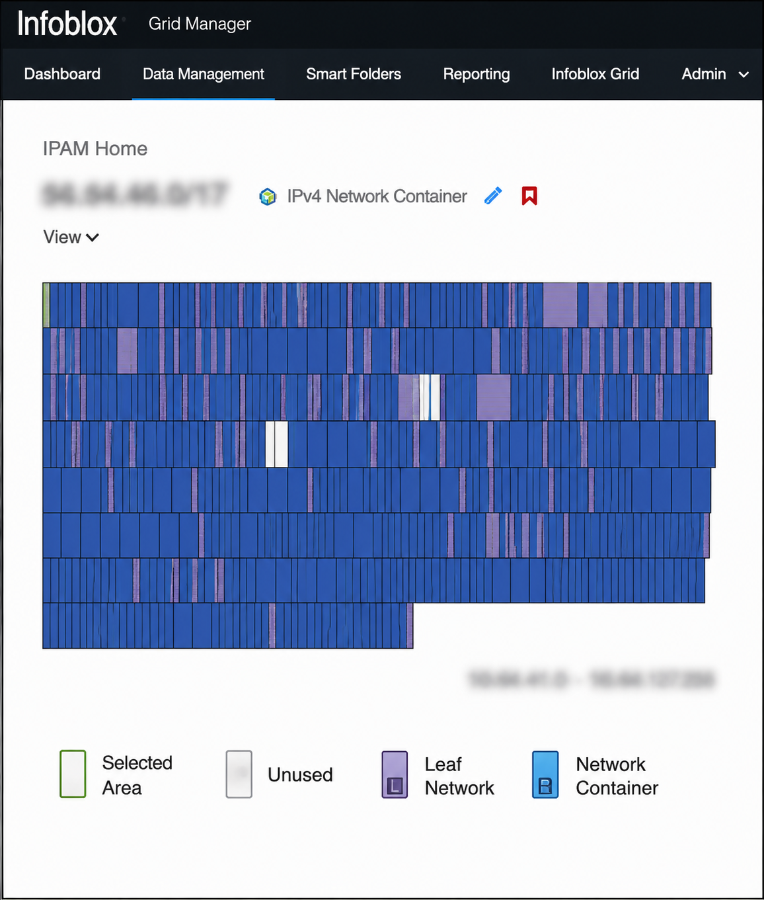

## Investigation Objective
## Environment
## Tools Used
## Investigation Workflow
## MITRE ATT&CK Mapping
## Key Findings
## Screenshots
## Skills Demonstrated
## Lessons Learned

## Screenshots

### QRadar Offense Overview

### CrowdStrike Validation

### Infoblox Correlation

## MITRE ATT&CK Mapping

| Technique | Description |
|------------|-------------|
| T1078 | Valid Accounts |
| T1110 | Brute Force |
| T1046 | Network Service Discovery |
| T1087 | Account Discovery |

Enterprise SOC Investigation Lab
QRadar | CrowdStrike | Tanium | Infoblox
